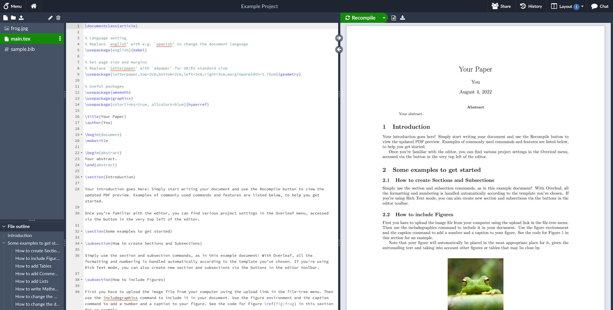

<h1 align="center">
  <br>
  <a href="https://www.overleaf.com"></a>
</h1>

<h4 align="center">An open-source online real-time collaborative LaTeX editor - Production Ready Deployment</h4>

<p align="center">
  <a href="https://github.com/overleaf/overleaf/wiki">Wiki</a> •
  <a href="https://www.overleaf.com/for/enterprises">Server Pro</a> •
  <a href="DEPLOYMENT.md">🚀 Deployment Guide</a> •
  <a href="#contributing">Contributing</a> •
  <a href="https://mailchi.mp/overleaf.com/community-edition-and-server-pro">Mailing List</a> •
  <a href="#authors">Authors</a> •
  <a href="#license">License</a>
</p>

<p align="center">
  <a href="https://github.com/features/actions"></a>
  <a href="https://www.docker.com/"></a>
  <a href="https://letsencrypt.org/"></a>
  <a href="DEPLOYMENT.md"></a>
</p>


<p align="center">
  Figure 1: A screenshot of a project being edited in Overleaf Community Edition.
</p>

## Community Edition

[Overleaf](https://www.overleaf.com) is an open-source online real-time collaborative LaTeX editor. We run a hosted version at [www.overleaf.com](https://www.overleaf.com), but you can also run your own local version, and contribute to the development of Overleaf.

> [!CAUTION]
> Overleaf Community Edition is intended for use in environments where **all** users are trusted. Community Edition is **not** appropriate for scenarios where isolation of users is required due to Sandbox Compiles not being available. When not using Sandboxed Compiles, users have full read and write access to the `sharelatex` container resources (filesystem, network, environment variables) when running LaTeX compiles.

For more information on Sandbox Compiles check out our [documentation](https://docs.overleaf.com/on-premises/configuration/overleaf-toolkit/server-pro-only-configuration/sandboxed-compiles).

## Enterprise

If you want help installing and maintaining Overleaf in your lab or workplace, we offer an officially supported version called [Overleaf Server Pro](https://www.overleaf.com/for/enterprises). It also includes more features for security (SSO with LDAP or SAML), administration and collaboration (e.g. tracked changes). [Find out more!](https://www.overleaf.com/for/enterprises)

## Keeping up to date

Sign up to the [mailing list](https://mailchi.mp/overleaf.com/community-edition-and-server-pro) to get updates on Overleaf releases and development.

## 🚀 Quick Start Deployment

### One-Click Production Deployment

This repository is configured for easy production deployment with:
- **Automated CI/CD** with GitHub Actions
- **Docker-based** containerized services
- **SSL/HTTPS** with automatic Let's Encrypt certificates
- **Monitoring & Health Checks** included
- **Multiple deployment options** (cloud platforms, VPS, etc.)

```bash
# 1. Clone this repository
git clone https://github.com/YOUR_USERNAME/overleaf-main.git
cd overleaf-main

# 2. Configure your environment
cp env.example .env
# Edit .env with your domain and settings

# 3. Deploy (Linux/macOS)
chmod +x scripts/deploy.sh
./scripts/deploy.sh

# 3. Deploy (Windows PowerShell)
.\scripts\deploy.ps1
```

**📖 Complete deployment guide:** [DEPLOYMENT.md](DEPLOYMENT.md)

### Cloud Platform Deployment

Deploy to your preferred platform with one click:

[](https://cloud.digitalocean.com/apps/new?repo=https://github.com/YOUR_USERNAME/overleaf-main/tree/main)

- **AWS**: ECS/Fargate ready
- **Google Cloud**: Cloud Run compatible
- **Azure**: Container Instances ready
- **Heroku**: App deployment configured

## Installation

We have detailed installation instructions in the [Overleaf Toolkit](https://github.com/overleaf/toolkit/).

## Upgrading

If you are upgrading from a previous version of Overleaf, please see the [Release Notes section on the Wiki](https://github.com/overleaf/overleaf/wiki#release-notes) for all of the versions between your current version and the version you are upgrading to.

## Overleaf Docker Image

This repo contains two dockerfiles, [`Dockerfile-base`](server-ce/Dockerfile-base), which builds the
`sharelatex/sharelatex-base` image, and [`Dockerfile`](server-ce/Dockerfile) which builds the
`sharelatex/sharelatex` (or "community") image.

The Base image generally contains the basic dependencies like `wget`, plus `texlive`.
We split this out because it's a pretty heavy set of
dependencies, and it's nice to not have to rebuild all of that every time.

The `sharelatex/sharelatex` image extends the base image and adds the actual Overleaf code
and services.

Use `make build-base` and `make build-community` from `server-ce/` to build these images.

We use the [Phusion base-image](https://github.com/phusion/baseimage-docker)
(which is extended by our `base` image) to provide us with a VM-like container
in which to run the Overleaf services. Baseimage uses the `runit` service
manager to manage services, and we add our init-scripts from the `server-ce/runit`
folder.


## Contributing

Please see the [CONTRIBUTING](CONTRIBUTING.md) file for information on contributing to the development of Overleaf.

## Authors

[The Overleaf Team](https://www.overleaf.com/about)

## License

The code in this repository is released under the GNU AFFERO GENERAL PUBLIC LICENSE, version 3. A copy can be found in the [`LICENSE`](LICENSE) file.

Copyright (c) Overleaf, 2014-2025.
